  <h1>JELKOV</h1>
  
Backend Engineer · Python · FastAPI · Data

  

    
    
  

  

    
    
  

---

## About Me

- Backend engineer focused on designing and building reliable APIs, data workflows, and scalable service architectures
- Primary stack: Python, FastAPI, Java, Spring
- Experienced with relational databases, cloud deployment, and data processing pipelines

---

## GitHub Stats & Language Usage

  
  

---

## Backend Stack

### Languages

  
  

### Frameworks

  
  
  

### Databases

  
  
  
  
  
  

### Cloud & Deployment

  
  
  
  
  
  
  

### Tools

  
  
  
  
  

---

## Additional Stack

### Frontend

  
  
  
  
  

### Data / Visualization

  
  
  

---

## Currently Focusing

  
  

